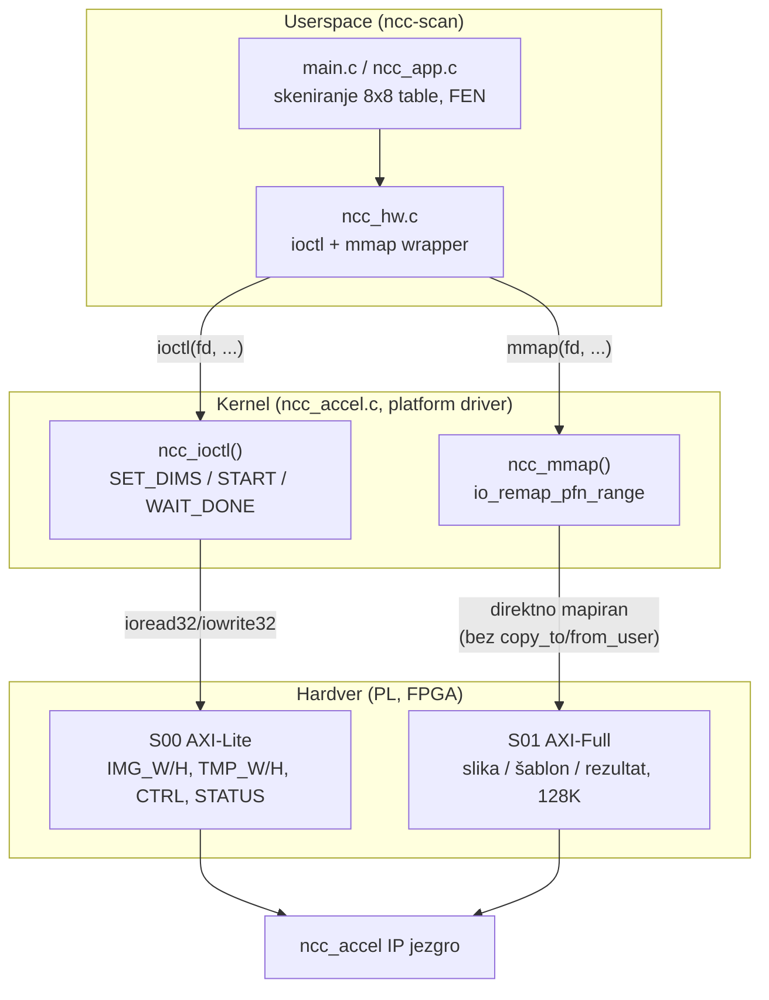

# EOS — Linux drajver za ncc_accel akcelerator

Ovaj dokument opisuje Korak 4 istog višepredmetnog projekta (PEUSN → PSDS → FVH → EOS):
pravi Linux kernel drajver i userspace aplikaciju za hardverski akcelerator `ncc_accel`
na Zybo ploči (Zynq-7010), koristeći isti bitstream koji je PSDS već doveo do rada u
bare-metal Vitis-u. Za pun istorijat odluka i bring-up proces, videti `Plan.md` u istom
folderu — ovde je samo finalna arhitektura i rezultati.

## 1. Arhitektura

Dve nezavisne instance akceleratora (`ncc0`, `ncc1`) daju dva nezavisna Linux uređaja,
`/dev/ncc0` i `/dev/ncc1`, sa sopstvenim `probe()`/`cdev`/mutex-om po instanci. Aplikacija
ih koristi paralelno — dok jedan računa, drugi može da počne sledeći posao — isto kao što
je bare-metal Vitis app radio ova dva jezgra nezavisno.

Kontrolni put (`ioctl`) i podatkovni put (`mmap`) su namerno razdvojeni. Kontrolne
komande su retke i male (postavi dimenzije, pokreni, čekaj gotovo), pa im odgovara
`ioctl`. Slika, šablon i rezultat su veliki blokovi (do 128K po instanci) kojima
aplikacija pristupa čestо i nasumično, pa im `mmap` daje direktan pristup bez
`copy_to_user`/`copy_from_user` po pikselu — identično ponašanje kao `Xil_Out32`/`Xil_In32`
petlje u bare-metal-u, samo iz userspace-a.

## 2. Registri i memorija

Registri na S00 (AXI-Lite, po instanci, 4K opseg, validno 0x00–0x3F):

| Offset | Registar | Napomena |
|---|---|---|
| `0x00` | `IMG_W` | širina slike (8 bita) |
| `0x04` | `IMG_H` | visina slike |
| `0x08` | `TMP_W` | širina šablona |
| `0x0C` | `TMP_H` | visina šablona |
| `0x10` | `IMG_ADDR` | rezervisano, bez efekta na hardver (potvrđeno u RTL-u) |
| `0x14` | `TMP_ADDR` | rezervisano, bez efekta na hardver (potvrđeno u RTL-u) |
| `0x30` | `CTRL` | upis 1 = start, briše `done_sticky` |
| `0x34` | `STATUS` | bit0 = `done_sticky` (read-only), bit1 = `busy` |

`IMG_ADDR`/`TMP_ADDR` su proverom PSDS VHDL izvora (`ncc_accel_slave_lite_v1_0_S00_AXI.vhd`)
potvrđeni kao loopback registri bez ijednog porta ka `ncc_core` — upis pa čitanje vraća
upisanu vrednost, ali jezgro tu vrednost nikad ne koristi. Umesto toga, jezgro uvek čita
sa fiksnih offseta u S01:

| Region | Offset u S01 | Kapacitet | Napomena |
|---|---|---|---|
| slika | `+0x00000` | 32 KB = 8192 reči | do ~90×90 |
| šablon | `+0x08000` | 32 KB = 8192 reči | do ~30×30 |
| rezultat | `+0x10000` | 64 KB = 16384 reči | Q1.31 skor po poziciji prozora |

Piksel je jedna 32-bitna reč (4 bajta), ne jedan bajt — ovo je proveravano dvaput u
razvoju drajvera jer je lako pretpostaviti suprotno, i pogrešna pretpostavka bi propustila
validaciju za slike do ~181×181 umesto stvarnog limita od ~90×90. Rezultati se porede kao
`u32`, ne `int32` — `0x80000000` (savršeno poklapanje) je negativan broj kao potpisani tip,
pa bi traženje maksimuma sa pogrešnim tipom odbacilo baš najbolji rezultat.

IP nema `interrupts` property u device tree-u — nema hardverski prekid. `NCC_WAIT_DONE`
zato anketira `STATUS` u petlji (`usleep_range(500, 1500)` između provera) umesto da čeka
na IRQ, sa podrazumevanim timeout-om od 1000 ms i mogućnošću prekida signalom
(`fatal_signal_pending`).

## 3. Odluka o DMA-u

DMA (preko `axi_cdma_0`) se ne koristi za prenos slike/šablona/rezultata, iz istog razloga
kao u PSDS bare-metal aplikaciji: `axi_interconnect_0` je konfigurisan kao deljena
magistrala (`STRATEGY=1`) i ne podržava burst prenose duže od 2 takta, što je dokazano na
pravom hardveru preko JTAG-a tokom PSDS bring-up-a. Umesto toga, prenos ide procesorski
(preko `mmap`-ovane memorije), isto kao bare-metal `Xil_Out32`/`Xil_In32` petlje — cena je
oko 10% ukupnog vremena, ali rad je pouzdan.

Pošto se DMA nije koristio ni u PSDS-u (bare-metal) ni u FVH-u (verifikacija), nastavni
cilj vežbi 11–12 (DMA API) nije demonstriran kroz izolovan sintetički primer u EOS-u —
odluka je bila da se ne uvodi veštački korak koji ne postoji nigde drugde u pipeline-u.

## 4. Merenje i poređenje (Korak 8)

Test slučaj: `board2.txt`, 90×90 segmenti po polju, 12 šablona (6 belih + 6 crnih figura),
očekivani FEN sa 32 zauzeta polja.

| | Bare-metal (Vitis) | Linux (ioctl+mmap) |
|---|---|---|
| ukupno vreme | 1.782 s | 1.906 s |
| FEN rezultat | tačan (32/32) | tačan (32/32), identičan |

Razlika je oko 7%, u skladu sa očekivanjem da syscall/ioctl/mmap overhead ne bude
dominantan — raspodela vremena na Linuxu potvrđuje to: "čekanje jezgra" (PL računanje)
zauzima 1676.6 ms od ukupnih 1906.5 ms, odnosno 87.9%, gotovo identično bare-metal
raspodeli (~87% PL računanje prema PSDS dokumentaciji). Ostatak (prenos u S01, čitanje
rezultata) je razlog za blagi dodatni overhead u odnosu na direktne `Xil_Out32`/`Xil_In32`
pozive, ali ne menja suštinski ukupno vreme.

## 5. Poznata ograničenja

Rootfs je konfigurisan kao initrd (u RAM-u), pa se sve promene na ploči — instalirane
lozinke, ručno učitani moduli, privremeni fajlovi — gube pri svakom restartu. Sam
`ncc-accel.ko` modul i `ncc-scan` aplikacija su ugrađeni u sliku i učitavaju se
automatski, pa ovo ne utiče na osnovnu funkcionalnost.

Efektivni maksimum veličine slike je oko 90×90 (8192 reči u 32 KB S01 regionu za sliku),
ne veći iznos koji bi region rezultata sam po sebi dozvolio za mali šablon. Ovo je
hardversko ograničenje, ne nešto što drajver namerno sužava.

Uređaji `/dev/ncc0` i `/dev/ncc1` imaju dozvole `0600` (samo root) — userspace aplikacija
mora da se pokreće sa `sudo` ili preko udev pravila koje bi promenilo vlasništvo/dozvole,
što nije urađeno u ovoj fazi.

`compat_ioctl` je postavljen na `compat_ptr_ioctl`, ali pošto `CONFIG_COMPAT` nije uključen
na ovom ARM32 kernelu, on se u praksi prevodi u `NULL` — nema uticaja sada, ali ostaje
ispravan ako se ikad pređe na kernel sa uključenim `CONFIG_COMPAT`.

## 6. Istorijat bring-up-a

Put od prvog `petalinux-build`-a do tačnog FEN rezultata na ploči nije bio pravolinijski —
uključivao je noćno zamrzavanje VM-a, više grešaka u proceni (restartovanje VM-a na
sumnju umesto na dokaz, dva sloja pogrešnih pretpostavki o registrima IMG_ADDR/TMP_ADDR i
`img_dirty` optimizaciji koja se ispostavilo da postoji samo u ranijem SystemC modelu, ne
u sintetizovanom hardveru), i jedan pravi Windows Hyper-V pad nezavisan od bilo čega u
projektu. Sve odluke, greške i njihove ispravke su hronološki zabeležene u `Plan.md` —
ovaj dokument namerno ne ponavlja tu istoriju, samo finalno stanje.
